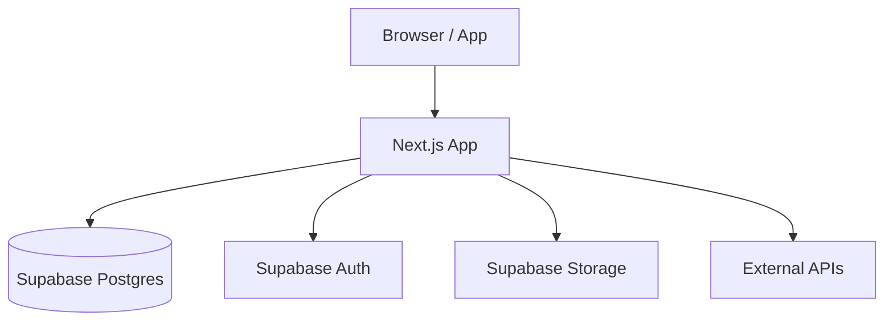

# Architecture

> Fill in this document during project kickoff. Update it whenever significant architectural decisions are made.

## System Overview

[Describe what this system does at a high level. Include a simple ASCII or Mermaid diagram if helpful.]

## Rendering Strategy

| Route type | Strategy | Reason |
|-----------|----------|--------|
| Marketing pages | Static (SSG) | Maximum performance, rarely changes |
| Dashboard / app pages | Server-side (SSR) | Fresh data, auth-gated |
| Data tables with filters | ISR or client-side | Balance freshness vs performance |
| Real-time features | Client-side + Supabase Realtime | Live updates |

## Data Flow

1. User interacts with a React component
2. Component calls a **Server Action** (preferred) or **API Route**
3. Server Action uses **Prisma** to query **Supabase Postgres**
4. Result flows back as serialised props or React state
5. For real-time: Supabase Realtime subscription updates client-side Zustand store

## Authentication Flow

1. User signs in via Supabase Auth (email/password, magic link, or OAuth)
2. Supabase issues JWT session cookie
3. Next.js middleware validates session on protected routes
4. Server Actions read session via `createServerClient` from `@supabase/ssr`
5. Client reads user via `useUser()` hook (Zustand store backed by Supabase session)

## Key Architectural Decisions

| Decision | Choice | Alternatives considered | Rationale |
|----------|--------|------------------------|-----------|
| ORM | Prisma | Drizzle, raw SQL | Type safety, migrations, good MCP support |
| Auth | Supabase Auth | NextAuth, Clerk | Tight DB integration, one provider |
| State (client) | Zustand | Redux, Context | Minimal boilerplate, no provider wrapping |
| Styling | Tailwind + shadcn/ui | CSS Modules, styled-components | Speed, AI-friendly, composable |

## External Services & Integrations

| Service | Purpose | SDK / Method |
|---------|---------|-------------|
| Supabase | Database, Auth, Storage | `@supabase/ssr`, Prisma |
| Vercel | Hosting, Edge Functions | CLI + GitHub integration |
| [Add others] | | |

## Performance Considerations

- Images: Use `next/image` for all images. Use WebP/AVIF.
- Fonts: Use `next/font` for zero-layout-shift font loading
- Bundle size: Check with `npm run build` output. Keep < 250kB first load JS.
- Database: Add indices on all foreign keys and frequently queried columns in Prisma schema

## Security Considerations

- All server actions validate user session before DB operations
- Supabase Row Level Security (RLS) policies as defence-in-depth
- Environment variables never exposed to client (no `NEXT_PUBLIC_` prefix for secrets)
- Input validation with Zod on all form data and API inputs
- CSRF: handled by Next.js Server Actions built-in

## Deployment

See `docs/DEPLOYMENT.md` for full deployment instructions.

- **Production:** Vercel (auto-deploy from `main`)
- **Staging:** Vercel preview (auto-deploy from `staging` branch)
- **Database:** Supabase — use branch databases for staging if on Pro plan
